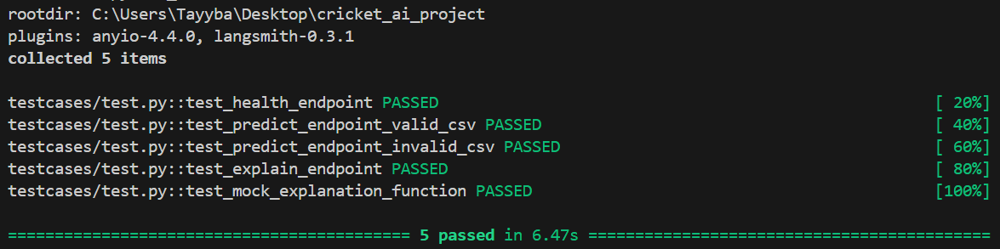

# Cricket Match Prediction API

A machine learning API for predicting T20 cricket match outcomes using match statistics and LLM-powered explanations.

## 🏏 Overview

This project implements a complete ML pipeline for cricket match prediction, including:
- **Exploratory Data Analysis (EDA)** with visualizations
- **Feature Engineering** with run rate calculations
- **Model Training** with multiple algorithms (Logistic Regression, Random Forest)
- **FastAPI Service** with prediction and explanation endpoints
- **LLM Integration** using Google Gemini Flash for human-readable explanations

## 📊 Dataset

The dataset contains T20 cricket match data with the following columns:
- `total_runs`: Total runs scored by chasing team so far
- `wickets`: Number of wickets fallen
- `target`: Target runs to win
- `balls_left`: Remaining balls in the match
- `won`: 1 if chasing team won, 0 if lost (target variable)

## 🚀 Quick Start
## 🚀 Run the Project

Make sure you have **Python 3.11.1** installed.  


### 1. Installation

```bash
# Clone the repository
git clone https://github.com/tayybahafeez/cricket_ai_project
cd cricket_ai_project

## Prerequisites

- Install Python 3.11.1

# Create virtual environment
python -m venv venv
source venv/bin/activate  # On Windows: venv\Scripts\activate

# Install dependencies
pip install -r requirements.txt
```

### 2. Set up Environment Variables (Optional)

For LLM explanations using Gemini Flash:

```bash
# Create .env file
echo "GOOGLE_API_KEY=your_gemini_api_key_here" > .env
```

### 3. Run the Complete Pipeline

```bash
# 1. Run EDA and generate insights
python -m cricket_ml.pipelines.eda

# 1. Run EDA and generate insights
python -m cricket_ml.pipelines.preprocess

# 2. Train the model
python -m cricket_ml.pipelines.train

# 2. Train the model
python -m cricket_ml.pipelines.inference

# 3. Start the API server
uvicorn cricket_ml.api.app:app --reload --host 127.0.0.1 --port 8000
```

### 4. Access the API

- **Interactive Documentation**: http://127.0.0.1:8000/docs
- **Alternative Docs**: http://127.0.0.1:8000/redoc
- **Health Check**: http://127.0.0.1:8000/health

## 🔧 API Usage

### Predict Match Outcomes

**Endpoint**: `POST /predict`

Upload a CSV file with cricket match data:

```bash
curl -X POST "http://127.0.0.1:8000/predict" \
     -H "Content-Type: multipart/form-data" \
     -F "file=@cricket_dataset_test.csv"
```

**Response**:
```json
{
  "status": "success",
  "predictions_file": "/predictions_6af4521f.csv"
  "details": {
    "total rows": 627,
    "filtered_row": 185,
    "prediction made": 132,
    "model used": "random_forest"
}
```

### Get AI Explanations

**Endpoint**: `GET /explain/{prediction_id}`

```bash
curl "http://127.0.0.1:8000/explain/6af4521f"
```

**Response**:
```json
{
  "prediction": "1",
  "confidence": 0.85,
  "explanation": "Based on the current match situation, the chasing team has a very high chance of winning because they are performing exceptionally well with a strong run rate and favorable conditions."
}
```

## 📈 Model Performance

| Model               | Accuracy | Precision | Recall | F1-Score | Best Parameters                                                    |
| ------------------- | -------- | --------- | ------ | -------- | ------------------------------------------------------------------ |
| Logistic Regression | 0.781    | 0.807     | 0.852  | 0.829    | `{'C': 10, 'solver': 'liblinear'}`                                 |
| Random Forest       | 0.966    | 0.967     | 0.979  | 0.973    | `{'max_depth': None, 'min_samples_split': 2, 'n_estimators': 200}` |

### Feature Engineering

The model uses engineered features:
- **Current Run Rate**: `(total_runs / balls_played) * 6`
- **Required Run Rate**: `(target / balls_left) * 6`

### Filtering Logic

The API processes only rows where:
- `balls_left < 60` (late innings focus)
- `target > 120` (meaningful targets)

## 🤖 LLM Integration

### Prompt Engineering

The system uses Google Gemini Flash for generating explanations with the following prompt template:

```
You are a cricket commentator explaining a match prediction to fans.

Match Context:
- Current runs: {total_runs}
- Wickets fallen: {wickets}
- Target to win: {target}
- Balls remaining: {balls_left}
- Current run rate: {current_run_rate}
- Required run rate: {required_run_rate}

The AI model predicts the chasing team has a {confidence}% chance of winning.

Write a brief, engaging explanation (2-3 sentences) that a cricket fan would understand.
```

### Confidence-Based Responses

The system provides different explanation styles based on prediction confidence:

- **High Confidence (>85%)**: Emphasizes strong performance indicators
- **Medium Confidence (60-85%)**: Balanced assessment with caveats
- **Low Confidence (<30%)**: Highlights challenging circumstances
- **Moderate Confidence (30-60%)**: Acknowledges uncertainty

### Fallback Mechanism

If Gemini API is unavailable, the system falls back to rule-based explanations.

## 🧪 Testing
All API and utility tests for the Cricket Match Prediction project passed successfully.
### Screenshot of Test Output



```bash
# Run all tests
pytest -v

# Run specific test file
pytest testcases/test.py

# Run with coverage
pytest --cov=cricket_ai
```

## 📁 Project Structure

```
cricket_ai_project/
├── cricket_ml/
│   ├── __init__.py 
│   ├── api/
│   │  ├── __init__.py
│   │   └── app.py              # FastAPI application
│   ├── llm/
│   │   ├── __init__.py
│   │   └── llm_model.py           # LLM integration
│   ├── pipelines/
│   │   ├── __init__.py
│   │   ├── eda.py              # Exploratory Data Analysis
│   │   ├── preprocess.py       # Data preprocessing
│   │   ├── train.py            # Model training
│   │   └── inference.py          # Prediction pipeline
│   └── utils/
│       ├── __init__.py
│       ├── config.py           # Configuration
│       └── logger.py           # Logging setup
├── models/
├── datasets/
│   │   ├── cricket_dataset.csv  # Training data
│   │   └── cricket_dataset_test.csv  # Test data
│   │   └──Visuals
│   │      └── heatmap.png
│   │   └──Predictions
│   │      └── data_123dr3.csv
├── testcases/
│   └── test.py                # Test suite
├── requirements.txt           # Dependencies
└── README.md
└── Report                 # This file
```

## 🔍 Key Insights from EDA

1. **Overall Win Rate**: ~65% for the dataset
2. **Late Innings Pressure**: Win rate drops significantly when `balls_left < 30`
3. **Wicket Impact**: Teams with ≤2 wickets have ~75% win rate vs ~45% for teams with ≥6 wickets
4. **Target Difficulty**: Higher targets (>150) significantly reduce win probability
5. **Strongest Predictor**: `balls_left` shows the highest correlation with match outcome

## 🛠️ Development

### Adding New Models

1. Add model to `cricket_ai/pipelines/train.py`
2. Update hyperparameter grid
3. Retrain and compare performance

### Extending LLM Integration

1. Add new provider in `cricket_ai/llm/llm_model.py`
2. Update configuration in `cricket_ai/utils/config.py`
3. Test with different prompt templates

### Custom Feature Engineering

1. Modify `engineer_features()` in `cricket_ai/pipelines/preprocess.py`
2. Update feature column handling in training and prediction
3. Retrain models with new features

## 📝 Model Report

See `Cricket_AI_Project_Report.pdf` for detailed analysis of:
- Data preprocessing decisions
- Model selection rationale
- Performance evaluation
- Limitations and future improvements

## 🚨 Error Handling

The API includes comprehensive error handling for:
- Malformed CSV files
- Missing required columns
- Invalid data types
- Empty datasets
- LLM API failures

## 🔒 Security Considerations

- Input validation for all endpoints
- File size limits for uploads
- Rate limiting (can be added)
- API key protection for LLM services

## 📊 Monitoring

The application includes structured logging for:
- Request/response tracking
- Model performance monitoring
- Error tracking and debugging
- LLM API usage

## 🤝 Contributing

1. Fork the repository
2. Create a feature branch
3. Add tests for new functionality
4. Submit a pull request

## 📄 License

This project is licensed under the MIT License.

## 🆘 Support

For questions or issues:
1. Check the API documentation at `/docs`
2. Review the test cases for usage examples
3. Check logs for debugging information
4. Open an issue in the repository

---

**Total Development Time**: ~6 hours
**Key Technologies**: FastAPI, scikit-learn, Google Gemini Flash, pandas, matplotlib
**Deployment Ready**: ✅ Production-ready with comprehensive error handling
